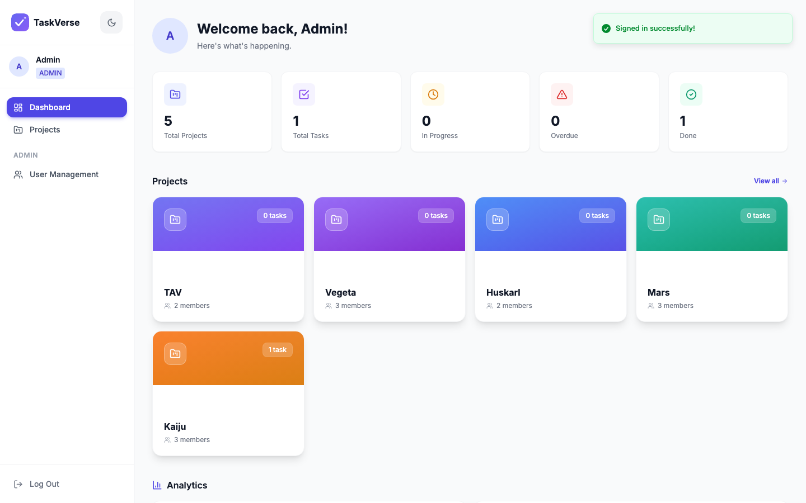
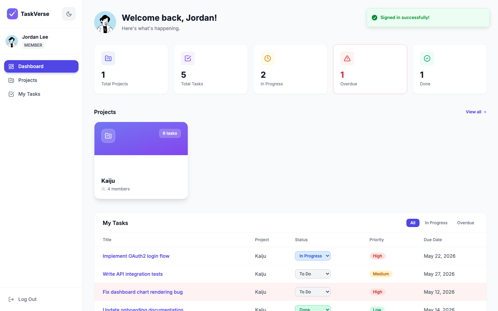

<div align="center">

<!-- LOGO -->


# ✦ TaskVerse

### _Where teams align, tasks flow, and projects ship._

<br/>

[](https://react.dev)
[](https://vitejs.dev)
[](https://tailwindcss.com)
[](https://expressjs.com)
[](https://www.mongodb.com/atlas)
[](LICENSE)

<br/>

> **TaskVerse** is a full-stack, role-based team task manager built for real teams.
> Admins orchestrate. Members execute. Everyone stays in the loop.

<br/>

[🚀 Live Demo](https://frontend-production-7cf5.up.railway.app) · [📖 API Docs](#-api-reference) · [🛠 Setup Guide](#-getting-started) · [🗂 Architecture](#-architecture)

</div>

---

## 📸 Dashboard Preview

<div align="center">


### Admin Dashboard



> _Admin dashboard — system-wide stats, SVG donut status chart, animated priority bars, per-project member breakdown table._

<br/>

### Member Dashboard



> _Member dashboard — assignee-scoped stat cards, personal project list, and a "My Tasks" table with inline status dropdowns, colored priority badges, and overdue-row highlighting._

</div>

---

## ✨ Feature Highlights

<table>
<tr>
<td width="50%">

### 🔐 Auth & Identity
- **JWT authentication** (24h expiry, auto-refresh prompt)
- **Tabbed login** — separate Admin / Member entry points
- **Member-only public signup** (admins are seeded or promoted)
- **Live email duplicate check** via debounced API call (500ms)
- **Password strength meter** — 6-segment bar + rule checklist
- **Session-expired banner** with redirect to `/login?expired=1`
- **DiceBear notionists avatars** — 12 choices at signup, stored in DB

</td>
<td width="50%">

### 👑 Role-Based Access Control
- **ADMIN** — full system access: all projects, all tasks, user management, role promotion, system-wide dashboard
- **MEMBER** — scoped access: only assigned projects & tasks, personal dashboard, inline status updates
- `ProtectedRoute` gates every authenticated page
- `AdminRoute` gates every admin-only page
- Roles are `UPPERCASE` throughout: `'ADMIN'` / `'MEMBER'`

</td>
</tr>
<tr>
<td width="50%">

### 📊 Dashboards (dual-mode)
**Admin:**
- 5 system-wide stat cards (projects, tasks, in-progress, overdue, done)
- SVG donut chart — status distribution
- Framer-motion animated priority bars
- Per-project member breakdown table (Avatar + name, task counts, progress bar)
- Unassigned row reconciles totals exactly

**Member:**
- Assignee-scoped stats (total, in-progress, overdue, done)
- Inline colored `<select>` status update (optimistic UI)
- Status colors: TODO=gray, IN_PROGRESS=blue, DONE=emerald

</td>
<td width="50%">

### 📁 Projects
- Create projects with name, description, **multi-member picker**
- `@mention` chip-based member selection (`MentionPicker`)
- Admin sees **all** projects; Members see only assigned ones
- Gradient accent bar per project card
- Live search bar with instant filter
- Admin hover-reveal delete button
- Framer-motion stagger list animations

</td>
</tr>
<tr>
<td width="50%">

### ✅ Tasks
- Create tasks with title, description, priority, due date
- **Multi-assignee** via `@mention` picker (`assigneeIds[]` array)
- Statuses: `TODO` → `IN_PROGRESS` → `DONE`
- Priorities: `LOW` / `MEDIUM` / `HIGH` with color badges
- Overdue detection with red highlighting
- `GET /api/tasks/mine` — personalized task feed for members
- Admin can browse all tasks across all projects

</td>
<td width="50%">

### 🎨 UI/UX Polish
- **Dark / Light theme** toggle (persisted via zustand + localStorage)
- **Framer-motion** animations — stagger, fade, slide, spring
- **Sonner toasts** — richColors, 9 toast trigger points across the app
- **Premium Landing** — glass navbar, aurora hero, infinite marquee, count-up stats, bento feature grid with cursor spotlight, How It Works, CTA, footer
- **Branded Spinner** — LogoMark SVG + spinning gradient arc + pulse animation
- Fully responsive layout

</td>
</tr>
</table>

---

## 🏗 Architecture

```
┌─────────────────────────────────────────────────────────────┐
│                        CLIENT (Browser)                      │
│  React 18 + Vite 5 │ Zustand │ React Router v6 │ Tailwind   │
│  Framer Motion │ Sonner │ React Hook Form │ Lucide Icons     │
└──────────────────────────┬──────────────────────────────────┘
                           │  HTTP/JSON  (Axios + interceptors)
                           ▼
┌─────────────────────────────────────────────────────────────┐
│                      API SERVER (Node.js)                    │
│  Express 4 │ JWT Auth │ RBAC Middleware │ express-rate-limit │
│  Mongoose 8 │ express-validator │ CORS                       │
└──────────────────────────┬──────────────────────────────────┘
                           │  Mongoose ODM
                           ▼
┌─────────────────────────────────────────────────────────────┐
│                    MongoDB Atlas (Free M0)                    │
│  Collections:  users  │  projects  │  tasks                  │
└─────────────────────────────────────────────────────────────┘
```

### Data Flow

```
User Action → React Component → API Module (axios)
  → Express Route → Middleware (auth → role → validate)
  → Controller → Mongoose → MongoDB Atlas
  → Response unwrapped by axios interceptor
  → Zustand store update → UI re-render + Sonner toast
```

---

## 🗂 Project Structure

```
team-task-manager/
│
├── 📁 frontend/
│   ├── public/
│   │   ├── images/                 # README screenshots (dashboard previews)
│   │   ├── _redirects              # SPA routing for Railway: /* /index.html 200
│   │   └── favicon.svg             # TaskVerse SVG brand mark
│   └── src/
│       ├── api/
│       │   ├── axios.js            # Base URL + response interceptor (envelope unwrap + 401 handler)
│       │   ├── auth.api.js         # login, register, me, checkEmail
│       │   ├── projects.api.js     # CRUD + member add/remove
│       │   ├── tasks.api.js        # CRUD + status patch + mine
│       │   ├── users.api.js        # CRUD + role patch (admin)
│       │   └── dashboard.api.js    # stats endpoint
│       ├── components/
│       │   ├── Avatar.jsx          # DiceBear avatar (sm/md/lg/xl, initials fallback)
│       │   ├── Badge.jsx           # Priority / status color badges
│       │   ├── Logo.jsx            # LogoMark SVG + wordmark
│       │   ├── MentionPicker.jsx   # @ trigger chip multi-select component
│       │   ├── Modal.jsx           # Accessible overlay modal
│       │   ├── ProjectForm.jsx     # Create/edit project
│       │   ├── Spinner.jsx         # Branded loading spinner
│       │   ├── TaskForm.jsx        # Create/edit task (all fields + assigneeIds)
│       │   ├── TaskStatusBadge.jsx # Colored status chip
│       │   └── ThemeToggle.jsx     # Sun/moon toggle button
│       ├── layouts/
│       │   └── AppLayout.jsx       # Dark sidebar + top bar + ThemeToggle
│       ├── pages/
│       │   ├── Landing.jsx         # Premium marketing landing page
│       │   ├── Login.jsx           # Tabbed Admin/Member login + signup flow
│       │   ├── Dashboard.jsx       # Role-aware dashboard (admin vs member)
│       │   ├── ProjectsList.jsx    # All projects grid with search
│       │   ├── ProjectDetail.jsx   # Project info + tasks + members tabs
│       │   ├── TaskDetail.jsx      # Full task view + edit + assignees
│       │   ├── MyTasks.jsx         # Member personal task feed
│       │   └── UsersAdmin.jsx      # Admin user management table
│       ├── routes/
│       │   ├── ProtectedRoute.jsx  # Redirect to /login if no token
│       │   └── AdminRoute.jsx      # Redirect if role !== 'ADMIN'
│       ├── store/
│       │   ├── authStore.js        # user, token, login(), logout() — localStorage backed
│       │   └── uiStore.js          # theme, toggleTheme(), initTheme() — zustand+persist
│       ├── hooks/
│       │   ├── useAuth.js          # Auth state convenience hook
│       │   └── useProjects.js      # Projects fetch + cache
│       └── utils/
│           ├── formatDate.js       # Date display helpers
│           └── isOverdue.js        # Due date comparison utility
│
├── 📁 backend/
│   ├── src/
│   │   ├── config/
│   │   │   └── db.js               # Mongoose connection (Atlas URI)
│   │   ├── models/
│   │   │   ├── User.js             # name, email, password, role, avatar, timestamps
│   │   │   ├── Project.js          # name, description, ownerId, members[], timestamps
│   │   │   └── Task.js             # title, desc, status, priority, dueDate, assigneeIds[]
│   │   ├── middleware/
│   │   │   ├── auth.js             # JWT verify → req.user
│   │   │   ├── role.js             # requireRole('ADMIN') factory
│   │   │   ├── validate.js         # express-validator error formatter
│   │   │   └── rateLimiter.js      # 20 req / 15 min on /api/auth
│   │   ├── routes/
│   │   │   ├── auth.routes.js
│   │   │   ├── user.routes.js
│   │   │   ├── project.routes.js
│   │   │   ├── task.routes.js      # /mine registered BEFORE /:id
│   │   │   └── dashboard.routes.js
│   │   ├── controllers/
│   │   │   ├── auth.controller.js
│   │   │   ├── user.controller.js
│   │   │   ├── project.controller.js
│   │   │   └── task.controller.js
│   │   ├── validators/
│   │   │   ├── auth.validator.js
│   │   │   ├── project.validator.js
│   │   │   └── task.validator.js
│   │   └── app.js                  # Express app setup, CORS, routes mount
│   ├── seed.js                     # Bootstrap first ADMIN user
│   ├── server.js                   # HTTP server entry point
│   ├── .env.example
│   └── package.json
│
├── .gitignore
└── README.md
```

---

## 🛠 Getting Started

### Prerequisites

| Tool | Version | Notes |
|------|---------|-------|
| Node.js | ≥ 18 | LTS recommended |
| npm | ≥ 9 | Comes with Node |
| MongoDB Atlas | Free M0 | Or any MongoDB URI |

---

### 1️⃣ Clone the Repository

```bash
git clone https://github.com/MansaGupta11/TaskVerse.git
cd TaskVerse
```

---

### 2️⃣ Backend Setup

```bash
cd backend
npm install
cp .env.example .env
```

Edit `.env` with your values:

```env
# ── Database ───────────────────────────────────────────────
MONGODB_URI=mongodb+srv://<user>:<password>@cluster0.xxxxx.mongodb.net/task-manager?retryWrites=true&w=majority

# ── Auth ───────────────────────────────────────────────────
JWT_SECRET=your-super-secret-key-at-least-32-chars
JWT_EXPIRES_IN=24h

# ── Server ─────────────────────────────────────────────────
PORT=5000
NODE_ENV=development

# ── CORS ───────────────────────────────────────────────────
CORS_ORIGIN=http://localhost:5173

# ── Seed Admin ─────────────────────────────────────────────
SEED_ADMIN_EMAIL=admin@example.com
SEED_ADMIN_PASSWORD=Admin@12345
```

Seed the first admin user:

```bash
node seed.js
# ✅ Admin user created: admin@example.com
```

Start the API server:

```bash
npm run dev    # nodemon watch mode
# API live at http://localhost:5000
```

---

### 3️⃣ Frontend Setup

```bash
cd ../frontend
npm install
```

Create the frontend env file:

```env
# frontend/.env.local
VITE_API_URL=http://localhost:5000/api
```

```bash
npm run dev
# App live at http://localhost:5173
```

---

### 4️⃣ First Login

| Role | Email | Password |
|------|-------|----------|
| **Admin** | `admin@example.com` | `Admin@12345` |
| **Member** | Sign up at `/login` → Member tab | your choice |

> Members self-register. Admins are promoted via the `/admin/users` panel.

---

## 🔌 API Reference

**Base URL:** `http://localhost:5000/api`

All protected endpoints require:
```
Authorization: Bearer <jwt_token>
```

All responses follow the envelope format:
```json
{ "success": true, "data": { ... } }
```

---

### 🔐 Auth

| Method | Endpoint | Auth | Description |
|--------|----------|------|-------------|
| `POST` | `/auth/register` | ❌ | Register new member. Role hardcoded `MEMBER`. Returns `{token, user}` |
| `POST` | `/auth/login` | ❌ | Login. Returns `{token, user}` |
| `GET` | `/auth/me` | ✅ | Get current authenticated user |
| `POST` | `/auth/check-email` | ❌ | Live duplicate check. Returns `{exists: bool}` |

---

### 👥 Users _(Admin only)_

| Method | Endpoint | Auth | Description |
|--------|----------|------|-------------|
| `GET` | `/users` | 🔒 ADMIN | List all users |
| `GET` | `/users/:id` | 🔒 ADMIN | Get user by ID |
| `PATCH` | `/users/:id` | 🔒 ADMIN | Update user details |
| `DELETE` | `/users/:id` | 🔒 ADMIN | Delete user |
| `PATCH` | `/users/:id/role` | 🔒 ADMIN | Promote / demote role |

---

### 📁 Projects

| Method | Endpoint | Auth | Description |
|--------|----------|------|-------------|
| `GET` | `/projects` | ✅ | ADMIN: all projects. MEMBER: assigned only |
| `POST` | `/projects` | ✅ | Create with `{name, description, memberIds[]}` |
| `GET` | `/projects/:id` | ✅ | Detail with populated members & tasks |
| `PATCH` | `/projects/:id` | ✅ | Update project |
| `DELETE` | `/projects/:id` | 🔒 ADMIN | Delete project |
| `POST` | `/projects/:id/members` | ✅ | Add member `{userId}` |
| `DELETE` | `/projects/:id/members` | ✅ | Remove member `{userId}` |

---

### ✅ Tasks

| Method | Endpoint | Auth | Description |
|--------|----------|------|-------------|
| `GET` | `/tasks/mine` | ✅ | Tasks where `assigneeIds` contains current user |
| `GET` | `/tasks` | 🔒 ADMIN | All tasks. Filter: `?projectId=` |
| `POST` | `/tasks` | ✅ | Create with `{title, status, priority, dueDate, projectId, assigneeIds[]}` |
| `GET` | `/tasks/:id` | ✅ | Task detail with populated assignees |
| `PATCH` | `/tasks/:id` | ✅ | Update task |
| `DELETE` | `/tasks/:id` | 🔒 ADMIN | Delete task |
| `PATCH` | `/tasks/:id/status` | ✅ | Update status. MEMBER: must be in `assigneeIds` |

---

### 📊 Dashboard

| Method | Endpoint | Auth | Description |
|--------|----------|------|-------------|
| `GET` | `/dashboard/stats` | ✅ | ADMIN: system-wide stats. MEMBER: assignee-scoped stats |

**Admin response shape:**
```json
{
  "totalUsers": 12,
  "totalProjects": 5,
  "totalTasks": 47,
  "overdueTasks": 3,
  "completionRate": 68,
  "statusBreakdown": { "TODO": 15, "IN_PROGRESS": 10, "DONE": 22 },
  "priorityBreakdown": { "LOW": 12, "MEDIUM": 20, "HIGH": 15 },
  "projectBreakdown": [ ... ]
}
```

---

## 🗄 Database Models

### User
```js
{
  name:      String (required),
  email:     String (unique, lowercase, required),
  password:  String (bcrypt hashed),
  role:      'ADMIN' | 'MEMBER'  (default: 'MEMBER'),
  avatar:    String (DiceBear seed, default: ''),
  createdAt, updatedAt
}
```

### Project
```js
{
  name:        String (required),
  description: String,
  ownerId:     ObjectId → User,
  members: [{
    userId:   ObjectId → User,
    joinedAt: Date,
    // _id: false
  }],
  createdAt, updatedAt
}
```

### Task
```js
{
  title:       String (required),
  description: String,
  status:      'TODO' | 'IN_PROGRESS' | 'DONE'  (default: 'TODO'),
  priority:    'LOW' | 'MEDIUM' | 'HIGH'          (default: 'MEDIUM'),
  dueDate:     Date,
  projectId:   ObjectId → Project (required),
  assigneeIds: [ObjectId → User],   // multi-assignee array
  assigneeId:  ObjectId → User,     // legacy single (kept for compatibility)
  creatorId:   ObjectId → User,
  createdAt, updatedAt
}
```

---

## 🚀 Deployment

> **🌐 Live Deployment**
>
> | Resource | URL |
> |----------|-----|
> | **Live App** | https://frontend-production-7cf5.up.railway.app |
> | **Backend API** | https://taskverse-production.up.railway.app/api |
> | **GitHub Repo** | https://github.com/MansaGupta11/TaskVerse |

TaskVerse deploys cleanly on **[Railway](https://railway.app)** — a single platform that hosts the Express API and the static React build side by side, with **MongoDB Atlas** as the managed database. The entire stack runs comfortably on free / hobby tiers.

### Architecture on Railway

```
┌───────────── Railway Project ────────────┐
│                                            │
│   ┌───────────┐      ┌──────────────┐    │
│   │  Frontend  │      │   Backend    │    │
│   │  (Static)  │─────▶│  (Node.js)   │    │
│   │  Vite dist │ API  │  Express API │    │
│   └───────────┘      └──────┬──────┘    │
│                            │           │
└──────────────────────────│──────────┘
                             ▼
                  ┌─────────────────┐
                  │  MongoDB Atlas  │
                  │   (Free M0)     │
                  └─────────────────┘
```

---

### Step 0 — Prerequisites

- A [Railway](https://railway.app) account (sign in with GitHub)
- A [MongoDB Atlas](https://www.mongodb.com/atlas) account
- Your code pushed to a **GitHub repository** (Railway deploys from GitHub)

---

### Step 1 — Provision MongoDB Atlas

1. Create a free **M0** cluster at [mongodb.com/atlas](https://www.mongodb.com/atlas)
2. **Database Access** → create a database user with a username and password
3. **Network Access** → add IP `0.0.0.0/0` (allow from anywhere — Railway uses dynamic IPs)
4. **Connect** → **Drivers** → copy the connection string. It looks like:
   ```
   mongodb+srv://<user>:<password>@cluster0.xxxxx.mongodb.net/task-manager?retryWrites=true&w=majority
   ```
5. Replace `<user>` / `<password>` with your real credentials and keep `/task-manager` as the database name — this becomes your `MONGODB_URI`.

---

### Step 2 — Deploy the Backend (Express API)

1. In Railway: **New Project** → **Deploy from GitHub repo** → select your repository
2. Open the created service → **Settings**:
   - **Root Directory**: `backend`
   - **Start Command**: `npm start` (Railway auto-detects this from `package.json`)
3. Go to the **Variables** tab and add:

   | Variable | Value |
   |----------|-------|
   | `MONGODB_URI` | _(your Atlas connection string from Step 1)_ |
   | `JWT_SECRET` | _(a long random string, ≥ 32 chars)_ |
   | `JWT_EXPIRES_IN` | `24h` |
   | `NODE_ENV` | `production` |
   | `PORT` | `5000` |
   | `CORS_ORIGIN` | _(leave blank for now — set in Step 4)_ |
   | `SEED_ADMIN_EMAIL` | `admin@yourdomain.com` |
   | `SEED_ADMIN_PASSWORD` | _(a strong password)_ |

4. Railway builds and deploys automatically. Under **Settings → Networking**, click **Generate Domain** — you'll get a URL like `https://taskverse-backend.up.railway.app`.
5. **Seed the admin user** (one-time): open the service's **Shell / one-off command** and run:
   ```bash
   node seed.js
   ```
   Or run it locally pointed at the production `MONGODB_URI`.

---

### Step 3 — Deploy the Frontend (Static React Build)

1. In the same Railway project: **New → GitHub Repo** (same repo) to add a second service
2. Open the new service → **Settings**:
   - **Root Directory**: `frontend`
   - **Build Command**: `npm run build`
   - **Output / Publish Directory**: `dist`
3. Go to the **Variables** tab and add:

   | Variable | Value |
   |----------|-------|
   | `VITE_API_URL` | `https://taskverse-backend.up.railway.app/api` _(your backend URL + `/api`)_ |

   > ⚠️ `VITE_` variables are baked in at **build time** — if you change `VITE_API_URL`, you must redeploy the frontend.

4. Under **Settings → Networking**, click **Generate Domain** — e.g. `https://taskverse.up.railway.app`.
5. SPA routing is handled automatically by `frontend/public/_redirects`:
   ```
   /* /index.html 200
   ```
   This ensures deep links like `/dashboard` or `/projects/123` resolve to the React app instead of 404ing.

---

### Step 4 — Connect the Two Services

1. Go back to the **backend** service → **Variables**
2. Set `CORS_ORIGIN` to your **frontend** URL (no trailing slash):
   ```
   CORS_ORIGIN=https://taskverse.up.railway.app
   ```
3. Redeploy the backend so the new CORS origin takes effect.

---

### Step 5 — Verify the Deployment

| Check | How |
|-------|-----|
| Backend is up | Visit `https://<backend>.up.railway.app/api` — should respond (not crash) |
| Frontend loads | Visit `https://<frontend>.up.railway.app` — the landing page renders |
| Login works | Sign in with the seeded admin credentials |
| No CORS errors | Open browser DevTools → Console while logging in |
| Deep links work | Navigate directly to `/dashboard` and refresh — no 404 |

---

### Continuous Deployment

Railway watches the connected GitHub branch (typically `main`). **Every push triggers an automatic rebuild and redeploy** of whichever service's root directory changed. No manual steps required after the initial setup.

### Deployment Troubleshooting

| Symptom | Cause | Fix |
|---------|-------|-----|
| Backend crashes on boot | Bad `MONGODB_URI` or Atlas IP not whitelisted | Verify the URI and add `0.0.0.0/0` in Atlas Network Access |
| `CORS error` in console | `CORS_ORIGIN` missing or has a trailing slash | Set it to the exact frontend URL, then redeploy backend |
| Frontend calls `localhost:5000` | `VITE_API_URL` not set at build time | Set the variable, then trigger a fresh frontend deploy |
| Deep-link refresh returns 404 | `_redirects` not picked up | Confirm `frontend/public/_redirects` exists and was built into `dist` |
| `401` right after deploy | Admin never seeded | Run `node seed.js` against the production database |
| Build fails on Railway | Node version mismatch | Add an `engines.node` field to `package.json` or a `.nvmrc` |

---

## 🔧 Environment Variables

### Backend

| Variable | Required | Description |
|----------|----------|-------------|
| `MONGODB_URI` | ✅ | MongoDB Atlas connection string |
| `JWT_SECRET` | ✅ | JWT signing secret (≥ 32 chars) |
| `JWT_EXPIRES_IN` | ✅ | Token lifetime e.g. `24h` |
| `PORT` | ✅ | API port (default: `5000`) |
| `NODE_ENV` | ✅ | `development` or `production` |
| `CORS_ORIGIN` | ✅ | Frontend URL for CORS header |
| `SEED_ADMIN_EMAIL` | ❌ | Email for seeded admin |
| `SEED_ADMIN_PASSWORD` | ❌ | Password for seeded admin |

### Frontend

| Variable | Required | Description |
|----------|----------|-------------|
| `VITE_API_URL` | ✅ | Backend API base URL |

---

## 🔒 Security

| Layer | Mechanism |
|-------|-----------|
| Password hashing | `bcrypt` (10 rounds) |
| Auth tokens | JWT HS256, 24h expiry |
| Rate limiting | 20 req / 15 min on `/api/auth` via `express-rate-limit` |
| Input validation | `express-validator` on all mutation routes |
| Role enforcement | Per-route `requireRole('ADMIN')` middleware |
| CORS | Allowlist-based via `CORS_ORIGIN` env var |
| 401 handling | Auto-clear token + redirect on expired sessions |

> ⚠️ **Important:** The default seed credentials (`admin@example.com` / `Admin@12345`) are for local development only. Change `SEED_ADMIN_EMAIL` and `SEED_ADMIN_PASSWORD` to strong, unique values before deploying to any shared or production environment.

---

## 🎨 Design System

| Token | Value | Usage |
|-------|-------|-------|
| Primary | `#6366F1` Indigo 500 | Buttons, links, logo gradient start |
| Secondary | `#8B5CF6` Violet 500 | Gradient end, accents |
| Success | `#10B981` Emerald 500 | DONE status |
| Warning | `#F59E0B` Amber 500 | MEDIUM priority, banners |
| Danger | `#EF4444` Red 500 | Overdue tasks, HIGH priority |
| Dark BG | `#0F172A` Slate 900 | Dark mode page background |
| Sidebar | `#1E293B` Slate 800 | Dark sidebar |

**Typography:** System font stack &nbsp;·&nbsp; **Animations:** Framer Motion (spring + ease) &nbsp;·&nbsp; **Icons:** Lucide React

---

## 📦 Tech Stack

### Frontend

| Package | Version | Role |
|---------|---------|------|
| `react` | 18 | UI framework |
| `vite` | 5 | Build tool & dev server |
| `tailwindcss` | 3 | Utility CSS (`darkMode:'class'`) |
| `react-router-dom` | 6 | Client-side routing |
| `framer-motion` | 12 | Animations |
| `zustand` | latest | State management + persistence |
| `react-hook-form` | latest | Form state & validation |
| `sonner` | latest | Toast notifications |
| `lucide-react` | latest | Icon library |
| `axios` | latest | HTTP client with interceptors |

### Backend

| Package | Version | Role |
|---------|---------|------|
| `express` | 4 | Web framework |
| `mongoose` | 8 | MongoDB ODM |
| `jsonwebtoken` | latest | JWT auth |
| `bcrypt` | latest | Password hashing |
| `express-validator` | latest | Input validation |
| `express-rate-limit` | latest | Auth rate limiting |
| `cors` | latest | Cross-origin control |
| `dotenv` | latest | Environment config |
| `nodemon` | dev | Auto-restart in development |

---

## 🧩 Key Implementation Details

<details>
<summary><strong>🔄 Axios Response Interceptor</strong></summary>

The axios instance in `src/api/axios.js` automatically unwraps the `{success, data}` envelope so components always receive the inner data directly. On 401 responses where a token exists, it fires a `sonner` toast, clears localStorage, and redirects to `/login?expired=1`.

</details>

<details>
<summary><strong>🏷 MentionPicker Component</strong></summary>

`MentionPicker.jsx` provides `@mention`-style multi-assignee input:
- Typing `@` opens a dropdown of project members
- Selected users appear as removable chip badges
- `Backspace` removes the last chip
- Click-outside closes the dropdown
- Outputs `assigneeIds[]` array to parent `TaskForm`

</details>

<details>
<summary><strong>🌙 Theme System</strong></summary>

Theme is persisted via `zustand` + `persist` middleware under the `'ui-theme'` localStorage key. `initTheme()` runs on app mount and toggles the `'dark'` class on `document.documentElement`. TailwindCSS `darkMode: 'class'` picks this up globally. The `<Toaster>` from `sonner` also receives the `theme` prop to match.

</details>

<details>
<summary><strong>🎯 Admin Dashboard: Project Breakdown Table</strong></summary>

The per-project member breakdown shows one row per member (Avatar, name, task counts per status, overdue count, completion bar) plus an **Unassigned** row for tasks with empty `assigneeIds` or assignees outside the project's member list. This ensures project totals always equal member rows + unassigned row.

</details>

<details>
<summary><strong>🛡 Route Registration Order</strong></summary>

In `task.routes.js`, `/mine` is registered **before** `/:id`. Express matches routes top-to-bottom — if `/:id` came first, `GET /tasks/mine` would be treated as task id `"mine"` and fail with a Mongoose cast error.

</details>

---

## 🧪 Testing

This project does not currently include an automated test suite. Both `backend/` and `frontend/` have no `test` script configured.

**Manual testing checklist:**

| Scenario | How to verify |
|----------|---------------|
| Admin login | Navigate to `/login`, select Admin tab, enter seeded credentials |
| Member signup | Select Member tab, register a new account, verify avatar picker works |
| Create project | Go to Projects → New Project, add members via `@mention` picker |
| Create task | Open a project, create task with multi-assignee, set priority & due date |
| Member task view | Log in as member, go to `/tasks/mine` — only assigned tasks appear |
| Status update | Member updates a task status inline on dashboard — optimistic update fires |
| Admin user mgmt | Go to `/admin/users`, promote a member to ADMIN |
| Theme toggle | Click the sun/moon button — persists across page reloads |
| Session expiry | Delete `token` from localStorage, navigate to `/dashboard` — redirected to login |

**Frontend build verification:**

```bash
cd frontend && npm run build
# Expected: exit 0, ~2187 modules transformed, JS bundle ~550kB
```

---

## 🤝 Contributing

Contributions are welcome! Here's how to get started:

1. **Fork** the repository and clone your fork
2. **Create a feature branch**: `git checkout -b feat/your-feature-name`
3. **Follow existing patterns**:
   - Backend: controller → route → validator chain
   - Frontend: API module → page component → Zustand store update
   - Use `sonner` for all user-facing feedback (no `alert()` or `console.log`)
   - Match Tailwind class conventions and dark-mode variants
4. **Test manually** using the checklist above before submitting
5. **Build the frontend** and confirm exit 0: `cd frontend && npm run build`
6. **Commit** with conventional commits: `git commit -m "feat: add calendar view"`
7. **Open a PR** against `main` with a clear description of the change

### Code Style

| Area | Convention |
|------|-----------|
| JS/JSX | No semicolons (frontend), CommonJS (backend) |
| API responses | Always `{ success: true, data: ... }` envelope |
| Role strings | Always `UPPERCASE`: `'ADMIN'`, `'MEMBER'` |
| Status strings | Always `UPPERCASE`: `'TODO'`, `'IN_PROGRESS'`, `'DONE'` |
| Toasts | Use `sonner` — `toast.success()`, `toast.error()`, `toast.promise()` |
| Theme | Always add `dark:` variants alongside light-mode Tailwind classes |

---

## 🔧 Troubleshooting

| Problem | Likely Cause | Fix |
|---------|-------------|-----|
| `MongooseError: buffering timed out` | `MONGODB_URI` is wrong or Atlas IP not whitelisted | Check URI format; add `0.0.0.0/0` to Atlas Network Access |
| `CORS error` in browser console | `CORS_ORIGIN` mismatch | Set `CORS_ORIGIN` to exact frontend URL (no trailing slash) |
| `401 Unauthorized` on all requests | JWT secret mismatch or token expired | Verify `JWT_SECRET` is identical on all server restarts; re-login |
| Login redirects back instantly | Token exists in localStorage from previous session | Clear localStorage and try again |
| `/tasks/mine` returns 500 | `ObjectId` cast error | Ensure `/mine` route is registered before `/:id` in `task.routes.js` |
| Avatar not showing | `avatar` field empty on User document | Re-register or update via `/api/users/:id` |
| Vite build fails | Dependency mismatch | Delete `frontend/node_modules` and re-run `npm install` |
| `seed.js` creates duplicate admin | Admin already exists | Safe to ignore — seed script checks for existing email |

## 🗺 Roadmap

- [ ] Real-time updates via WebSockets / Server-Sent Events
- [ ] File attachments on tasks
- [ ] Email notifications on assignment & due-date reminders
- [ ] Calendar / Gantt view
- [ ] Team workload heatmap
- [ ] Slack / Discord webhook integrations
- [ ] Task comments & activity feed
- [ ] Public project sharing links

---

## 📄 License

MIT © 2025 TaskVerse Contributors

---

<div align="center">

**Built with ♥ using React, Express & MongoDB**

_If TaskVerse helped your team ship faster, give it a ⭐ on GitHub!_

</div>
